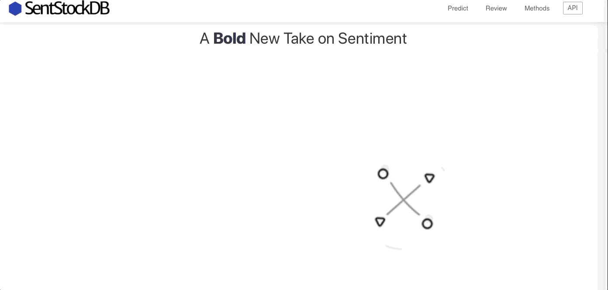
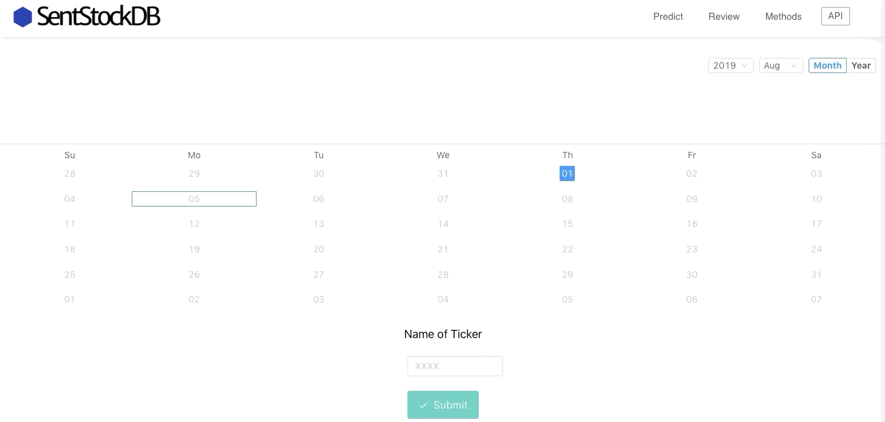
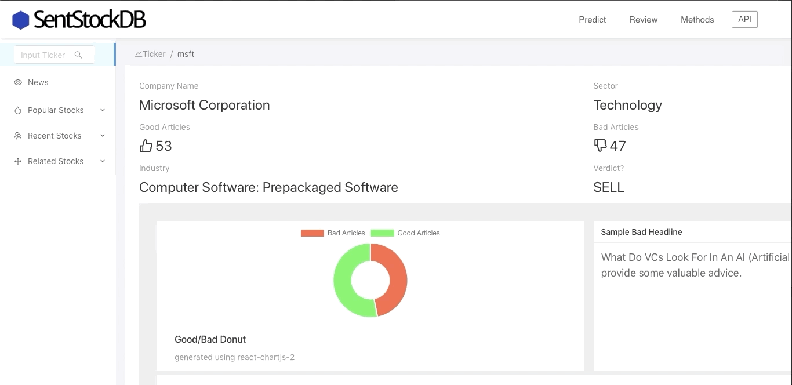
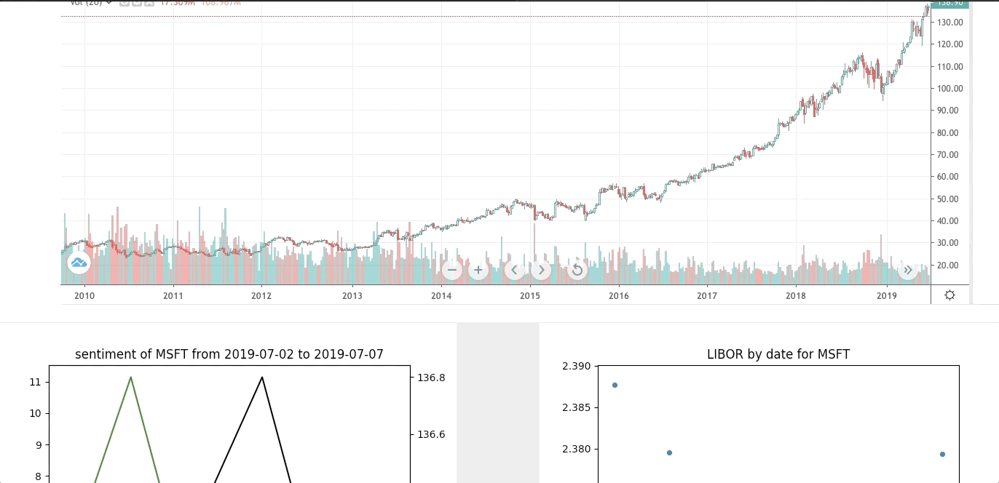
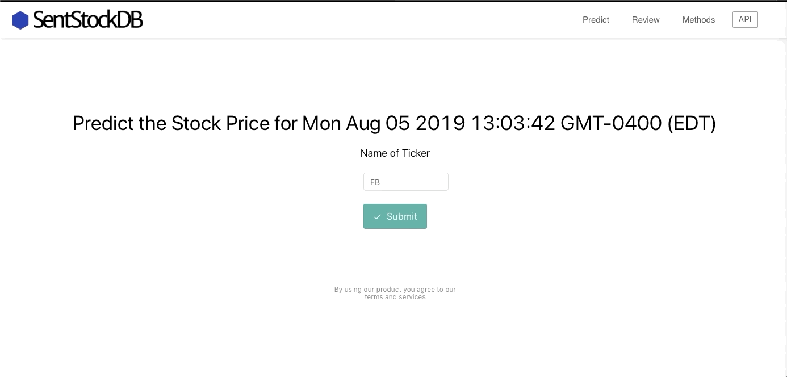
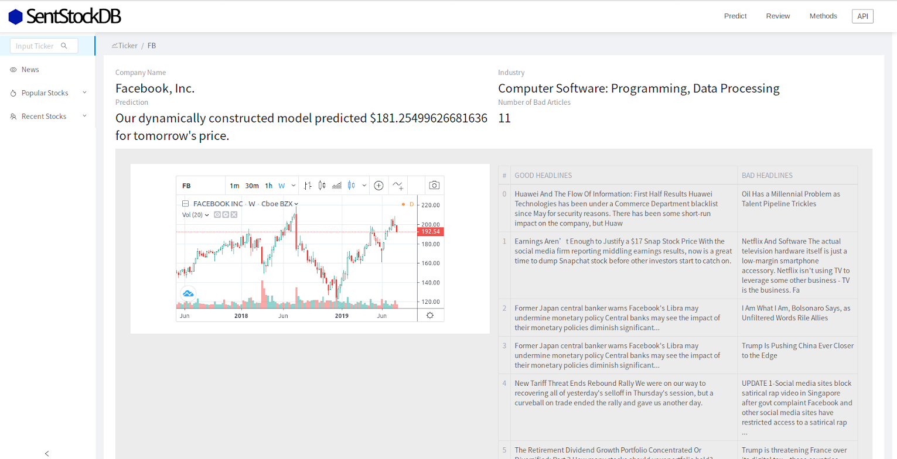

# API
The analytics from this project are available as a standalone REST API service. 

[API documentation on Postman](https://documenter.getpostman.com/view/8309272/SVYnSgEo?version=latest)

Example Request
``` python
import requests
url = 'localhost:5002/companies/get-prediction?ticker=tsla'
headers = {}
response = requests.request('GET', url, headers = headers, data = payload, allow_redirects=False, timeout=undefined, allow_redirects=false)
print(response.text)
```

Example Response
``` python
{
  "date_calculated": "Wed, 31 Jul 2019 00:00:00 GMT",
  "date_predicted": "Thu, 01 Aug 2019 00:00:00 GMT",
  "prediction": "Our dynamically constructed model predicted $229.50125977538016 for tomorrow's price.",
  "ticker": "tsla"
}
```

# Web UI

## Homepage


## Review Page

<br>
<br>
<br>

<br>
<br>
<br>

<br>
<br>
<br>

<br>
<br>
<br>

<br>
<br>
<br>
## Predict Page

<br>
<br>
<br>

